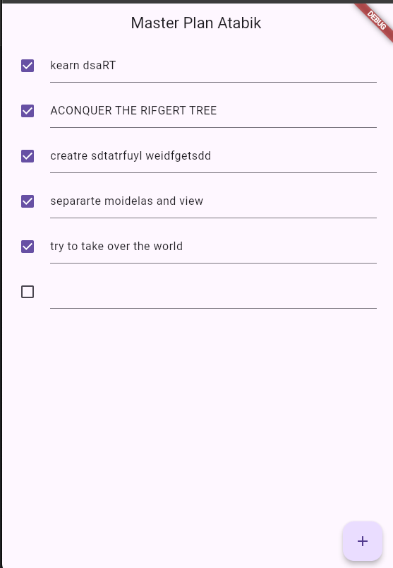
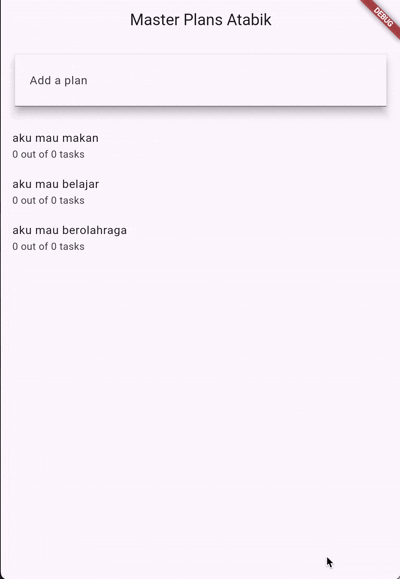

## Tugas Praktikum 1
1. Jelaskan maksud dari langkah 4 pada praktikum tersebut! Mengapa dilakukan demikian?
- tujuannya untuk mempermudah import di file lain, ketika ingin menggunakan plan atau task cukup tulis import '../models/data_layer.dart';kondsep clean arsitektur supaya kdode lebih rapi dan mudah maintenance
2. mengapa perlu variable plan di langkah 6? mengapa dibuat const?
- plan adalah objek dari class Plan yang berfungsi untuk penyimpanan data utama daftar tugas, semua perubahan akan memanipulasi variable ini lalu di render ulang menggunkan setState
- const menunjukan bahwa nilai awal data tersebut immutable, flutter juga akan lebih optimal merender widget
3. capture hasil
- 
4. Apa kegunaan method pada langkah 11 dan 13 dalam lifecycle state?
- langkah 11 berguna untuk Dipanggil satu kali saat widget dibuat Membuat ScrollController Menambahkan listener untuk menghilangkan keyboard saat scroll, agar input bawah tidak tertutup keyboard (khusus iOS behavior)
- langkah 13 berguna untuk Dipanggil ketika widget dihancurkan Membersihkan memory dengan controller.dispose() Mencegah memory leak

## Tugas Praktikum 2
1. Jelaskan mana yang dimaksud InheritedWidget pada langkah 1 tersebut! Mengapa yang digunakan InheritedNotifier?
- InheritedNotifier adalah bagian turunan dari InheritedWidget. karena aplikasi to-do punya data yang sering berubah, sehingga butuh listener otomatis agar UI ikut berubah tanpa setState lagi di UI layer. maka dari itu dibutuhkan InheritedNotifier
2. Jelaskan maksud dari method di langkah 3 pada praktikum tersebut! Mengapa dilakukan demikian?
Method tersebut logika bisnis (business logic) untuk:
Menghitung jumlah task yang selesai (completedCount)
Menampilkan teks progress (completenessMessage)
Method ini disimpan di model karena itu adalah logika perhitungan data, bukan urusan UI.
Ini membuat aplikasi lebih rapi, scalable dan mengikuti arsitektur yang baik.
3. Capture
- 

## tugas Praktikum 3
1. jelaskan diagram
- pada bagian kiri sebelum navigator push. plan provider membungkus PlanCreatorScreen artinya seluruh state plan hanya tersedia pada screen tersebut, pada tahap ini aplikasi hanya menangani 1 rencana
- pada bagian kanan, ketika user memilih sebuah plan, seriap plan berada dalam list plans, PlanScreen menerima plan tertentu dalam parameter, UI Task List dipisah ke screen baru

2. Capture
- 
